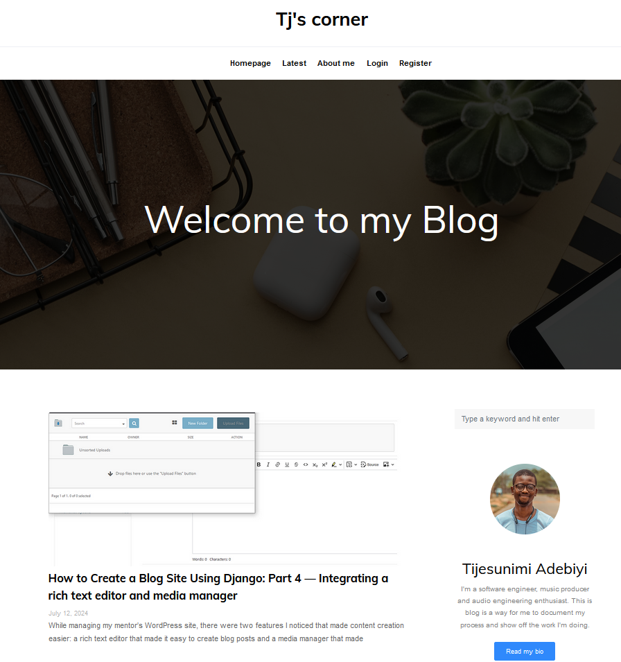

# django_blog_recreated

Experimenting with Django, I built this blog site. It has user authentication functionality and has kind of like a Content Management System vibe  
  
  
[You can find the site live here](http://django-env.eba-dtkmcjvg.af-south-1.elasticbeanstalk.com)
  
   
  
   

   

